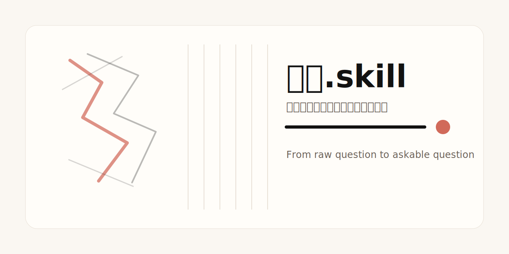

# 提问.skill



把小白问题拷打成能发给真人的成熟提问。  
**不回答，不教学，不安慰，先把问题问明白。**

`提问.skill` 不是一个“帮你润色一下措辞”的礼貌工具。它更像一个短程审讯器：先拿用户的原始问题做一次内部摩擦扫描，再用 2～6 个短问题去钉对象、场景、约束、代价和目标。前提不够，就不给成品；前提够了，才吐出一句能发给真人的成熟问题。

## 一句话定位

> 把“原始人问题”拷打成“问过 agent 也不显得外行”的问题。

## 它适合什么

v1 只做这五类：

- **技术**问题
- **产品**问题
- **工具 / skill / agent** 使用与选择
- **科研**方向与实验组织
- **项目决策**与方案约束

典型输入：

- `蒸馏具体怎么用啊，如果用手机的话`
- `我想找一个偏科研项目、轻量级的 harness 相关 skill`
- `Win10 桌面版项目选哪个模型和推理等级比较稳`

## 它不做什么

- **不回答原问题**
- 不讲教程
- 不代做方案拍板
- 不给模型推荐、工具排行、研究路线答案
- 不把 `skill / agent / harness / model / 蒸馏` 这种混词默认当一回事
- 不拿医疗、法律、危机、自伤、自杀、家暴、未成年人风险等高风险题材开“拷打模式”

## 工作方式

1. **Scope gate**：先看题材值不值得进入拷打模式
2. **Friction scan**：偷偷试理解一下，找出默认回答最容易滑坡的地方
3. **Pressure loop**：用 2～6 个短问题追打最致命的前提缺口
4. **Hard gate**：答不上关键前提，就不给成熟问题
5. **Single output**：只吐一句问题，不附带长解释

## 气质

默认口吻是：**轻度阴阳，但不爆粗**。

它不是为了羞辱用户，而是为了制造一种必要的不舒服：让用户意识到自己缺的不是答案，而是**提问资格里的前提**。

如果题材不适合阴阳，例如普通沟通、职业表达、非紧急人际问题，它会自动降成更克制的冷刀模式。

## 输出长什么样

默认只输出一句给真人的问题：

```text
我想问：<半口语主问题>（背景：<平台/目标/约束/已尝试/风险之一到三项，越短越好>）
```

带伤放行时，会把未确认的风险直接写进问题里，而不是假装问题已经成熟。

## 参数

- `--agent`：最终问题改写成给 Claude / Codex / ChatGPT 等 agent 的版本
- `--wounded`：显式带伤放行；输出最低可用问题，并把风险写进去
- `--cold`：去掉阴阳味，只保留锋利但克制的澄清

## 快速示例

### 基本用法

```text
$tiwen-skill 我想找一个偏科研项目，轻量级的 harness 相关 skill
```

### 给 agent

```text
$tiwen-skill --agent 这个 skill 怎么给 Claude 用？
```

### 带伤放行

```text
$tiwen-skill --wounded Win10 桌面版软件开发类似网约车的项目，选择哪个模型比较合适？
```

## 安装

### 方式 1：GitHub Release

1. 下载 Release 附件里的 `tiwen-skill.skill`
2. 按你的 agent / Codex 平台方式导入该 skill
3. 重新加载 skills 或重启环境

### 方式 2：源文件安装

把 `tiwen-skill/` 目录放进你的 skills 目录中，然后重新加载技能。

> 如果你的环境支持从 GitHub repo/path 安装 skill，也可以直接指向本仓库里的 `tiwen-skill/`。

## 安全边界

下列题材会**立即退出**拷打模式，改成安全导向：

- 自伤 / 自杀 / 精神危机
- 医疗急症 / 误服药物 / 急性症状
- 法律风险 / 家暴 / 虐待 / 未成年人风险
- 骗局 / 紧急财务伤害 / 人身安全问题

详见：`tiwen-skill/references/safety-boundary.md`

## 自测

已覆盖并手工走读的对抗性场景：

- 手机 / skill / 蒸馏混词
- 科研 harness 找 skill
- 模型 / 推理等级焦虑
- 明确要求改写成给 agent 的问题
- 普通职场沟通降级
- 高风险题材立即退出

相关文件：

- `SELF_TEST.md`
- `tiwen-skill/references/self-test-cases.md`

## 发布文件

- Skill 本体：`tiwen-skill/`
- 可分发包：`dist/tiwen-skill.skill`
- 版本说明：`RELEASE_NOTES.md`
- GitHub Release 文案：`GITHUB_RELEASE_0.1.0.md`
- Repo 简介 / topics 建议：`REPO_METADATA.md`

## 当前限制

- 目前最稳的是技术 / 项目类问题
- 对极短输入，语气仍可能偏硬
- 现在是手工自测，不是自动化回归
